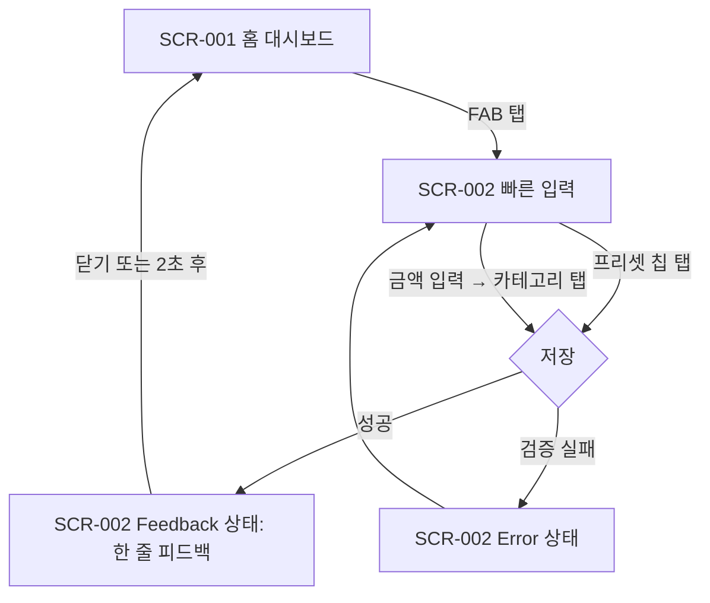
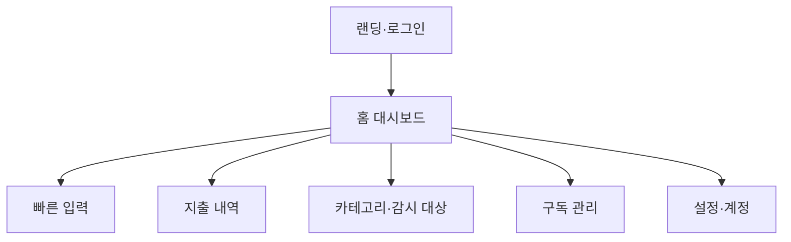
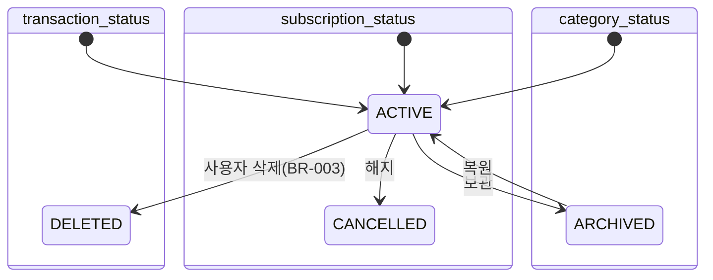
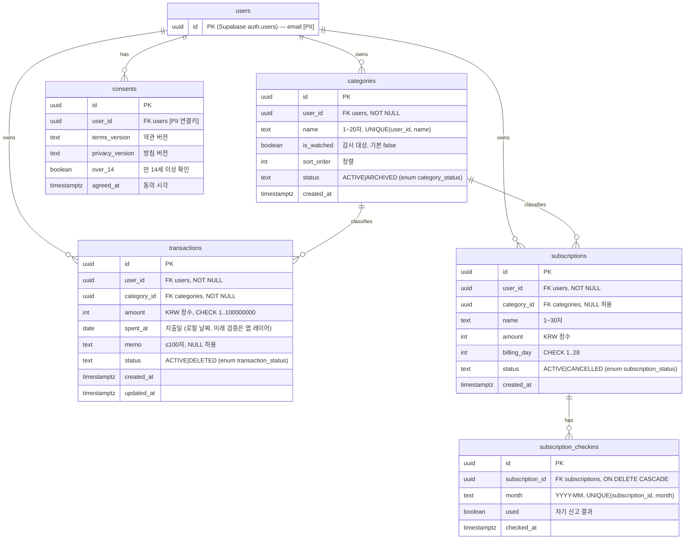
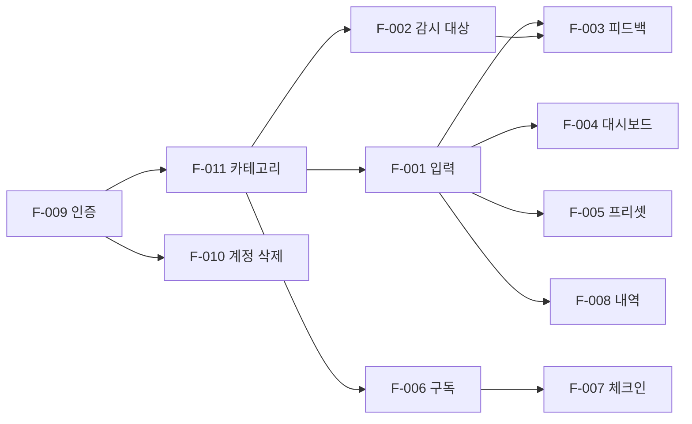

> **2026-09-27 범위 전환:** 본인 1명 사용, 데이터는 브라우저 localStorage에만 저장. 로그인(F-009)·동의·계정 삭제(F-010 → "모든 데이터 지우기")는 폐기, 티어 Lite. 이 문서의 인증·DB·분석 관련 서술은 DB·외부 공개 전환 시 기준으로만 유효 — 현행 명세는 docs/prd v1.1.0.

<!-- tier: spec-common §0 L1~L5 판정. 하나라도 false면 Scale. status: 사용자 승인 후 Approved로 — make-prd 변환 게이트 -->
<!-- 역참조: 이 문서는 PLAN.md(씀 출시 마스터 플랜) §2 MVP 기획서 페이즈의 산출물이다. 입력: /Users/jongyeon/Downloads/가계부-아이디어-스케치.md (2026-09-14) -->
<!-- tier_evidence 근거: L1 false=회원 로그인·분석 계측 존재 / L2 false=2차 타겟(가계부 이탈자)의 쓰기 존재 / L3 true=결제 없음 / L4 false=외부 사용자의 지출 기록이 이 서비스에 의존 / L5 false=포트폴리오 목적상 런칭 포스트·검색 등록 예정 -->

# MVP 기획서 — 씀 (sseum)

## 1. 서비스 컨셉
가계부를 깔았다가 다시 안 보게 된 사람에게, 모든 지출을 2~3탭으로 기록하되 **본인이 정한 "감시 대상" 지출의 반복 패턴을 입력 직후 한 줄로 되돌려주는** 웹 가계부. "얼마 썼나"가 아니라 "뭘 자주 하나"를 보여줘 조절을 유도한다.

## 2. 문제 정의
| ID | 문제(사용자 고통) | 근거 | 연결 기능 |
| -- | ---- | ---- | ---- |
| PP-001 | 가계부에 입력은 하지만 다시 안 보게 된다 — 기록이 행동으로 이어지지 않는다 | 스케치 §1 과거 경험. 웹은 알림 접점이 약해 "다시 보기"가 구조적으로 어렵다 | F-003, F-004 |
| PP-002 | 기존 가계부는 "이번 달 식비 45만원" 집계까지만 보여주고, "이번 주 배달 3번째"류 반복 감지가 없다 | 스케치 §2 차별점 (뱅크샐러드·토스·편한가계부 대비) | F-002, F-003 |
| PP-003 | 수동 입력이 번거로워 3개월 내 무너진다 | 스케치 §6 리스크 "수동 입력 피로" | F-001, F-005 |
| PP-004 | 구독은 매달 나가는데 실제로 쓰는지 인지하지 못한다 | 스케치 §3 조절 대상 "구독 비용" | F-006, F-007 |

## 3. 타겟 사용자
- **첫 100명:** 1차 = 본인(포트폴리오 겸 실사용). 2차 = 가계부 앱을 깔았다가 안 보게 돼서 접은 20~30대 직장인, 지출 중 배달·술/여가·구독처럼 "줄이고 싶은 항목"이 명확한 사람.
- **기기/환경:** 모바일 브라우저 우선(iOS Safari 17+, Android Chrome 최신 2버전), 데스크톱 Chrome/Safari 보조. 뷰포트 360px~. 한국어·KRW 단일.
- **제외 사용자:** 자동 카드 연동을 원하는 사람, 예산·자산 관리를 원하는 사람, 만 14세 미만(대상 아님 — 가입 시 만 14세 이상 확인 체크).

## 4. 성공 지표 & 검증 가설
| ID | 가설 | 지표 | 목표 | 측정 시점 | 실패 시 행동 |
| -- | ---- | ---- | ---- | ---- | ---- |
| H-01 | 입력 직후 피드백 한 줄이 "기록만 하고 안 본다"를 깬다 — 주 4일 이상 입력이 2주간 유지된다 | 사용자별 주간 입력일 수 (EVT-TXN-001 기준 distinct date) | 활성 사용자 중앙값 ≥ 4일/주, 2주 연속 | 런칭 +14일 (판정일) | 미달 → Pivot(피드백 방식 재설계). **표본 조건:** 가입 사용자 ≥ 5명 미만이면 판정 보류·2주 연장 |
| H-02 | 감시 대상 지정 + 즉시 피드백이 반복 지출 횟수를 줄인다 | 감시 대상 카테고리의 주간 입력 건수, 2주차 vs 1주차 | 활성 사용자 중 50% 이상에서 감소 | 런칭 +14일 | 미달 → Persevere 금지, 피드백 문구·노출 위치 A/B 1회 후 재판정 |
| H-03 | 입력이 2~3탭·10초 안에 끝나야 지속된다 | EVT-TXN-001 `duration_ms` p50, `tap_count` p50 | p50 ≤ 10,000ms, 탭 ≤ 3 | 런칭 +14일 | 미달 → 입력 화면 마찰 제거(프리셋 노출 확대) |
<!-- 실패 시 행동은 사전 명시. 각 지표는 §16 이벤트로 계측 가능해야 함 -->

## 5. MVP 기능 범위
| ID | 기능 | 설명 | 우선순위 | 연결 PP |
| -- | ---- | ---- | ---- | ---- |
| F-001 | 빠른 지출 입력 | 금액 + 카테고리 + (선택) 메모, 2~3탭 완료. 날짜 기본 오늘 | P0 | PP-003 |
| F-002 | 감시 대상 지정 | 카테고리 중 N개를 감시 대상으로 토글. 대시보드·피드백에 우선 노출 | P0 | PP-002 |
| F-003 | 입력 직후 즉시 피드백 | 저장 직후 한 줄: "이번 주 배달 3번째 · 이번 달 누적 12만원 · 지난달 이맘때 대비 +2회". 감시 대상이면 강조 | P0 | PP-001, PP-002 |
| F-004 | 홈 대시보드 | 최상단 감시 대상 카드(주간 횟수·월 누적·전월 비교), 아래 이번 달 전체 요약 | P0 | PP-001 |
| F-005 | 원탭 프리셋 + 카테고리 자동 제안 | 최근 30일 빈도 상위 조합(카테고리+금액)을 프리셋 칩으로 노출, 금액 입력 시 최근 사용 카테고리 우선 정렬. 별도 테이블 없이 거래에서 파생 | P1 | PP-003 |
| F-006 | 구독 등록·고정비 반영 | 이름·금액·결제일 등록. 대시보드 월 요약에 고정비로 합산(거래 자동 생성 없이 파생 계산) | P1 | PP-004 |
| F-007 | 구독 월 1회 자기 신고 | 매월 첫 진입 시 "이번 달 이거 썼어요? Y/N". 2개월 연속 N이면 해지 검토 배지 | P1 | PP-004 |
| F-008 | 지출 내역 조회·수정·삭제 | 월별 목록, 항목 수정·소프트 삭제 | P0 | PP-003 |
| F-009 | 회원 인증 | 이메일 매직링크 로그인(비밀번호 없음). 약관·개인정보 동의 기록 | P0 | — |
| F-010 | 계정 삭제 | 본인 계정·전체 데이터 즉시 삭제 (강제 트리거: 회원 기능 존재) | P0 | — |
| F-011 | 카테고리 관리 | 기본 카테고리 시드(식비·배달·술/여가·구독·교통·생활·기타) + 추가·이름 변경·보관 | P1 | PP-003 |
<!-- 콘텐츠 소요: 실데이터 콘텐츠 없음. 카피(피드백 문구·빈 상태·온보딩 3줄)만 반나절. 기본 카테고리 시드 7개는 코드 상수 -->

### Phase 2 제외 (지금 안 만드는 것)
| 기능 | 제외 이유 |
| ---- | ---- |
| Web Push 주간 요약(PWA) | 권한 허용·iOS 홈 화면 추가 장벽. 입력 순간 피드백이 접점 역할 (스케치 §5) |
| CSV/엑셀 업로드·내보내기 | 필요해지면 추가 |
| CODEF 카드사 API 연동 | 공개 서비스에서 금융 계정 취급 부담 |
| 은행·마이데이터 연동 | 사업자 허가제, 개인 불가 |
| 결제 문자/알림 파싱 | 네이티브 전용, 웹 불가 |
| 예산 설정·자산 관리 | 컨셉과 무관 |
| 카테고리별 입력 정밀도 차등(하루 총액 입력) | H-03 결과 보고 판단. 지금은 "기타" 카테고리로 대체 |
| 소셜 로그인(Google/Apple) | 매직링크로 충분. 사용자 요청 시 추가 |
| 수입 기록 | 컨셉이 지출 조절. 자산 관리로 번질 위험 |

## 6. 사용자 플로우
### FLOW-001: 지출 입력 → 즉시 피드백 → 대시보드 — 목표 10초

### 예외 경로
| 단계 | 예외 상황 | 시스템 동작 | 관련 화면 상태 |
| ---- | ---- | ---- | ---- |
| 저장 | 금액 0 이하·비정수 | 저장 거부, 필드 에러 | SCR-002 Error |
| 저장 | 네트워크 없음 | 저장 실패 안내·재시도 버튼, 입력값 보존 | SCR-002 Offline |
| 저장 | 세션 만료 | SCR-006으로 이동, 로그인 후 SCR-002 복귀(입력값은 유실 허용) | SCR-006 |
| 피드백 | 전월 데이터 없음 | 비교 구절 생략 ("이번 주 배달 1번째 · 이번 달 8,000원") | SCR-002 Feedback |
| 진입 | 월 첫 진입 + 활성 구독 존재 | SCR-001 상단에 자기 신고 카드 삽입 (F-007) | SCR-001 Loaded(체크인) |
<!-- Happy Path는 단 1개. 모든 mermaid 노드에 SCR-NNN 포함 -->

## 7. IA (Information Architecture)
### 사이트맵

### 라우트 표
| 화면 | SCR-ID | 라우트 | 인증 | 렌더링 전략 |
| ---- | ---- | ---- | ---- | ---- |
| 홈 대시보드 | SCR-001 | `/` | 필요 | SSR(동적, 쿠키 기반 사용자별) — Server Component |
| 빠른 입력 | SCR-002 | `/input` | 필요 | SSR 셸(카테고리·프리셋 서버 로드) + CSR 폼(Client Component) + Server Action 저장 |
| 지출 내역 | SCR-003 | `/transactions?month=YYYY-MM` | 필요 | SSR(searchParams 동적) |
| 카테고리·감시 대상 | SCR-004 | `/categories` | 필요 | SSR + Server Action 토글 |
| 구독 관리 | SCR-005 | `/subscriptions` | 필요 | SSR + Server Action |
| 랜딩·로그인 | SCR-006 | `/login` | 불필요 | **SSG**(정적 — 유일한 공개 페이지, OG·메타데이터 담당) |
| 설정·계정 | SCR-007 | `/settings` | 필요 | SSR |
<!-- ISR: 해당 없음 — 사용자별 데이터 화면뿐이라 재검증 캐시 대상이 없다. 이용약관·개인정보처리방침은 SCR-006 하위 정적 라우트(/terms, /privacy)로 SSG, 별도 SCR 아님(화면 정의 불필요한 법적 텍스트). 실데이터 콘텐츠 분량: 약관·방침 각 1페이지 -->

## 8. 화면 정의서
### SCR-001: 홈 대시보드
**구성 요소**
| EL-ID | 요소 | 타입 | 필수 | 비고/조건 |
| ---- | ---- | ---- | ---- | ---- |
| EL-HOME-001 | 감시 대상 카드 목록 | 카드 리스트 | Y | 카테고리별: 이번 주 횟수·이번 달 누적·전월 동기간 비교(BR-005). 감시 대상 0개면 SCR-004 유도 CTA |
| EL-HOME-002 | 이번 달 전체 요약 | 요약 블록 | Y | 총 지출, 고정비(구독 파생, BR-006), 카테고리 상위 3개 |
| EL-HOME-003 | 최근 입력 5건 | 리스트 | Y | 탭 시 SCR-003 |
| EL-HOME-004 | 입력 FAB | 버튼 | Y | SCR-002 이동. 44×44 이상 |
| EL-HOME-005 | 구독 자기 신고 카드 | 카드 | N | 월 첫 진입 + 미신고 활성 구독 존재 시 (BR-008) |
| EL-HOME-006 | 하단 내비게이션 | 내비 | Y | 홈·내역·구독·설정 |

**화면 상태**
| 상태 | UI |
| ---- | ---- |
| Empty | 거래 0건: "첫 지출을 기록해 보세요" + FAB 강조. 감시 대상 미설정 안내 |
| Loaded | 감시 대상 카드 → 요약 → 최근 입력 |
| Loading | 카드·요약 스켈레톤 (Suspense) |
| Error | 집계 실패 안내 + 재시도. 최근 입력은 별도 Suspense로 부분 표시 |
| Offline | 마지막 SSR 결과 유지 + 상단 오프라인 배너 |
| NoPermission | 세션 없음 → SCR-006 리다이렉트 (화면 UI 없음) |
| Partial | 집계 성공·구독 조회 실패 시 EL-HOME-005 생략 |

### SCR-002: 빠른 입력
**구성 요소**
| EL-ID | 요소 | 타입 | 필수 | 비고/조건 |
| ---- | ---- | ---- | ---- | ---- |
| EL-INPUT-001 | 프리셋 칩 | 칩 그룹 | N | 최근 30일 빈도 상위 4개 조합(BR-007). 탭 = 즉시 저장 (탭 1회) |
| EL-INPUT-002 | 금액 입력 | 숫자 입력 | Y | `inputmode="numeric"`, 정수 KRW, 천 단위 구분 표시 |
| EL-INPUT-003 | 카테고리 선택 | 칩 그룹 | Y | 최근 사용순 정렬, 감시 대상 배지. 탭 = 저장 트리거 |
| EL-INPUT-004 | 메모 | 텍스트 | N | 접힘 기본, 최대 100자 |
| EL-INPUT-005 | 날짜 | `<input type="date">` | Y | 기본 오늘, 미래 불가(BR-002) |
| EL-INPUT-006 | 피드백 한 줄 | 토스트/시트 | Y | 저장 성공 시 (BR-005 문구). 감시 대상이면 강조 색 |

**화면 상태**
| 상태 | UI |
| ---- | ---- |
| Empty | 카테고리 0개(전부 보관됨): SCR-004 유도 |
| Loaded | 프리셋 → 금액 → 카테고리 |
| Loading | 저장 중 칩 비활성 + 스피너 |
| Error | 필드 에러(금액·날짜) 또는 서버 오류 배너 |
| Offline | 저장 버튼 비활성 + "오프라인" 안내, 입력값 유지 |
| NoPermission | SCR-006 리다이렉트 |
| Partial | 프리셋 조회 실패 시 EL-INPUT-001 생략, 나머지 정상 |

### SCR-003: 지출 내역
**구성 요소**
| EL-ID | 요소 | 타입 | 필수 | 비고/조건 |
| ---- | ---- | ---- | ---- | ---- |
| EL-TXN-001 | 월 선택기 | 세그먼트 | Y | 이전/다음 달, `month` 쿼리 반영 |
| EL-TXN-002 | 일자별 그룹 리스트 | 리스트 | Y | 일 소계 표시 |
| EL-TXN-003 | 항목 편집 시트 | 바텀시트 | Y | 금액·카테고리·메모·날짜 수정, 삭제(BR-003) |
| EL-TXN-004 | 월 합계 | 텍스트 | Y | — |

**화면 상태**
| 상태 | UI |
| ---- | ---- |
| Empty | "이 달엔 기록이 없어요" + 입력 CTA |
| Loaded | 그룹 리스트 |
| Loading | 리스트 스켈레톤 |
| Error | 조회 실패 + 재시도 |
| Offline | 배너, 편집 비활성 |
| NoPermission | SCR-006 리다이렉트 |
| Partial | 해당 없음 |

### SCR-004: 카테고리·감시 대상
**구성 요소**
| EL-ID | 요소 | 타입 | 필수 | 비고/조건 |
| ---- | ---- | ---- | ---- | ---- |
| EL-CAT-001 | 카테고리 리스트 | 리스트 | Y | 이름·감시 토글·보관 |
| EL-CAT-002 | 감시 대상 토글 | 스위치 | Y | 최대 5개(BR-004) |
| EL-CAT-003 | 카테고리 추가 | 인라인 폼 | Y | 이름 1~20자, 사용자 내 유일(BR-009) |
| EL-CAT-004 | 이름 변경·보관 | 액션 | Y | 보관 시 기존 거래는 유지 |

**화면 상태**
| 상태 | UI |
| ---- | ---- |
| Empty | 해당 없음 (시드 7개 항상 존재) — 전부 보관 시 "보관됨" 섹션만 |
| Loaded | 활성 → 보관 섹션 |
| Loading | 스켈레톤 |
| Error | 토글 실패 시 롤백 + 토스트 |
| Offline | 토글 비활성 |
| NoPermission | SCR-006 리다이렉트 |
| Partial | 해당 없음 |

### SCR-005: 구독 관리
**구성 요소**
| EL-ID | 요소 | 타입 | 필수 | 비고/조건 |
| ---- | ---- | ---- | ---- | ---- |
| EL-SUB-001 | 구독 리스트 | 리스트 | Y | 이름·금액·결제일·이번 달 사용 여부·해지 검토 배지(BR-010) |
| EL-SUB-002 | 구독 추가 폼 | 시트 | Y | 이름·금액·결제일(1~28) |
| EL-SUB-003 | 월 사용 여부 Y/N | 토글 버튼 | Y | 해당 월 체크인(BR-008) |
| EL-SUB-004 | 해지 처리 | 액션 | Y | status CANCELLED, 이력 유지 |
| EL-SUB-005 | 월 고정비 합계 | 텍스트 | Y | 활성 구독 합 |

**화면 상태**
| 상태 | UI |
| ---- | ---- |
| Empty | "매달 나가는 구독을 등록해 두세요" + 추가 CTA |
| Loaded | 리스트 + 합계 |
| Loading | 스켈레톤 |
| Error | 저장 실패 배너 |
| Offline | 폼 비활성 |
| NoPermission | SCR-006 리다이렉트 |
| Partial | 해당 없음 |

### SCR-006: 랜딩·로그인
**구성 요소**
| EL-ID | 요소 | 타입 | 필수 | 비고/조건 |
| ---- | ---- | ---- | ---- | ---- |
| EL-LOGIN-001 | 서비스 소개 3줄 | 히어로 | Y | 한 줄 컨셉 + 피드백 예시 문구 (LCP 요소, 서버 렌더링) |
| EL-LOGIN-002 | 이메일 입력 | 입력 | Y | 매직링크 발송 |
| EL-LOGIN-003 | 약관·개인정보·만 14세 이상 동의 | 체크박스 | Y | 첫 로그인 시 필수, 동의 기록(BR-011) |
| EL-LOGIN-004 | 발송 완료 안내 | 텍스트 | Y | "메일함을 확인하세요" |
| EL-LOGIN-005 | 약관·방침 링크 | 링크 | Y | `/terms`, `/privacy` |

**화면 상태**
| 상태 | UI |
| ---- | ---- |
| Empty | 해당 없음 |
| Loaded | 히어로 + 폼 |
| Loading | 발송 중 버튼 비활성 |
| Error | 이메일 형식 오류 / 발송 실패 / 레이트리밋(ERR-AUTH-002) |
| Offline | 발송 비활성 |
| NoPermission | 해당 없음 |
| Partial | 해당 없음 |

### SCR-007: 설정·계정
**구성 요소**
| EL-ID | 요소 | 타입 | 필수 | 비고/조건 |
| ---- | ---- | ---- | ---- | ---- |
| EL-SET-001 | 계정 정보 | 텍스트 | Y | 이메일 표시 |
| EL-SET-002 | 로그아웃 | 버튼 | Y | — |
| EL-SET-003 | 계정 삭제 | 버튼 + 확인 시트 | Y | 이메일 재입력 확인 후 즉시 삭제(BR-012). 브라우저 `confirm()` 금지, 자체 시트 |
| EL-SET-004 | 법적 문서 링크 | 링크 | Y | 약관·방침·분석 도구 고지 |
| EL-SET-005 | 피드백 링크 | 링크 | Y | 문의 mailto 또는 폼 링크 |

**화면 상태**
| 상태 | UI |
| ---- | ---- |
| Empty | 해당 없음 |
| Loaded | 리스트 |
| Loading | 삭제 처리 중 |
| Error | 삭제 실패 배너 |
| Offline | 삭제 비활성 |
| NoPermission | SCR-006 리다이렉트 |
| Partial | 해당 없음 |

## 9. 도메인 규칙 & 상태 전이
### 비즈니스 규칙
| ID | 규칙 | 강제 지점 | 에러 코드 |
| ---- | ---- | ---- | ---- |
| BR-001 | 금액은 1 이상 100,000,000 이하 정수(KRW) | API + 화면 | ERR-TXN-001 |
| BR-002 | 지출일은 오늘(사용자 로컬 Asia/Seoul) 이후 불가, 앱 레이어 검증 | API + 화면 | ERR-TXN-002 |
| BR-003 | 삭제는 소프트 삭제(status DELETED). 집계·피드백에서 제외 | API | ERR-TXN-003 |
| BR-004 | 감시 대상은 사용자당 최대 5개 | API + 화면 | ERR-CAT-001 |
| BR-005 | 피드백 문구 = "이번 주 {카테고리} {n}번째 · 이번 달 누적 {월합계} · 지난달 이맘때 대비 {±k회}". 주 = 월요일 시작. 전월 동기간 = 전월 1일~전월 같은 일자. 전월 데이터 0건이면 비교 구절 생략 | 서버 계산(Server Action 응답) | — |
| BR-006 | 고정비 = 활성 구독 금액 합. 거래를 자동 생성하지 않는다 (파생 표시) | 대시보드 집계 | — |
| BR-007 | 프리셋 = 최근 30일 (카테고리, 금액) 조합 빈도 상위 4, 2회 이상만 | 서버 조회 | — |
| BR-008 | 구독 체크인은 (구독, 월) 당 1회. 월 첫 진입 시 미신고 구독이 있으면 대시보드에 카드 노출 | API(UNIQUE) | ERR-SUB-001 |
| BR-009 | 카테고리 이름은 사용자 내 유일, 1~20자 | API(UNIQUE) | ERR-CAT-002 |
| BR-010 | 직전 2개월 연속 체크인 N이면 "해지 검토" 배지 | 서버 조회 | — |
| BR-011 | 첫 로그인 시 약관·개인정보·만 14세 이상 동의 없이는 데이터 화면 진입 불가. 동의 버전·시각 저장 | 미들웨어 + API | ERR-AUTH-003 |
| BR-012 | 계정 삭제 시 사용자 전 데이터 하드 삭제(거래·카테고리·구독·체크인·동의), auth 사용자 삭제. 백업 보존 30일 후 자동 파기 | API | ERR-ACC-001 |
| BR-013 | 매직링크 발송은 이메일당 5분에 3회 | 인증 API | ERR-AUTH-002 |
<!-- 모든 BR은 하나의 ERR 코드에 매핑 (계산·표시 규칙은 에러 없음) -->

### 상태 전이

<!-- 모든 상태 = §11 DB enum 컬럼과 1:1 -->

### 계산 규칙
| 항목 | 공식 | 경계 조건 |
| ---- | ---- | ---- |
| 이번 주 횟수 | count(거래 where category, spent_at ∈ [이번 주 월요일, 오늘], status=ACTIVE) | 월요일 첫 입력 = 1번째 |
| 이번 달 누적 | sum(amount where category, spent_at ∈ 이번 달, ACTIVE) | — |
| 전월 동기간 비교 | count(이번 달 1일~오늘) − count(전월 1일~전월 min(오늘 일자, 전월 말일)) | 전월 0건이면 구절 생략(BR-005). 31일→전월 30일까지 |
| 월 총 지출 | sum(ACTIVE 거래, 이번 달) + 고정비(BR-006) | 구독 0개면 고정비 0 |
| 해지 검토 | 직전 2개월 체크인 모두 used=false | 체크인 미응답은 N으로 세지 않음 |

## 10. 권한 매트릭스
| 역할 | 리소스 | 본인 리소스 | 타인 리소스 |
| ---- | ---- | ---- | ---- |
| user | transactions | RW | — (RLS `user_id = auth.uid()`, 403/404) |
| user | categories | RW | — |
| user | subscriptions / subscription_checkins | RW | — |
| user | consents | R, W(생성만) | — |
| user | 계정(auth.users) | R, 삭제 | — |
| anon | 전부 | — | — (SCR-006·/terms·/privacy만 접근) |
<!-- 관리자 역할 없음. 각 행은 PRD TC에서 타인 리소스 거부 케이스로 검증 (IDOR) -->

## 11. 데이터 모델
### ERD

### 제약조건
| 테이블 | 제약 |
| ---- | ---- |
| categories | UNIQUE(user_id, name); 감시 대상 ≤5는 앱 레이어(BR-004) |
| transactions | CHECK(amount BETWEEN 1 AND 100000000); status enum; FK category_id RESTRICT(보관은 허용, 삭제 없음) |
| subscriptions | CHECK(billing_day BETWEEN 1 AND 28); status enum |
| subscription_checkins | UNIQUE(subscription_id, month) |
| consents | user당 최신 1행 조회(agreed_at DESC) |
| 전 테이블 | RLS 활성: `user_id = auth.uid()` (checkins는 subscriptions 조인) |
<!-- status 컬럼 값 = §9 상태다이어그램과 일치. 타임존 검증은 앱 레이어(UTC DB CHECK 금지).
개인정보: email(auth.users)만 [PII]. 그 외 테이블은 user_id로 연결되는 행위 데이터(지출 내역) — 유출 시 개인 소비 패턴 노출로 영향 산정 대상.
파기 정책: 계정 삭제 시 하드 삭제(BR-012) + Supabase 자동 백업 보존 기간(무료 플랜 기준 확인, OQ-003) 경과 후 소멸. 소프트 삭제(transactions DELETED)는 UX용이며 법적 파기와 무관 — 계정 삭제 시 함께 하드 삭제 -->

### 인덱스 전략 (Scale)
| 테이블 | 인덱스 | 근거(조회 패턴) |
| ---- | ---- | ---- |
| transactions | (user_id, spent_at DESC) WHERE status='ACTIVE' | 월별 내역·집계·피드백 전부 기간 범위 조회 |
| transactions | (user_id, category_id, spent_at) | 카테고리별 주간·월간 횟수(BR-005) |
| subscription_checkins | UNIQUE(subscription_id, month) | 체크인 존재 확인 |

## 12. API 명세
Next.js Server Actions 를 1차 인터페이스로 쓰되, 계약은 아래 REST 표기로 고정한다(PRD에서 Route Handler로 노출 가능).
| Method | Endpoint | 인증 | 설명 | 핵심 파라미터 |
| ---- | ---- | ---- | ---- | ---- |
| GET | `/api/v1/dashboard?month=YYYY-MM` | 필요 | 감시 대상 카드·월 요약·최근 5건·미신고 구독 | month |
| POST | `/api/v1/transactions` | 필요 | 지출 생성, 응답에 피드백 문구 포함(BR-005) | amount, category_id, spent_at, memo?, via_preset |
| GET | `/api/v1/transactions?month=YYYY-MM` | 필요 | 월별 내역 | month |
| PATCH | `/api/v1/transactions/{id}` | 필요 | 수정 | amount, category_id, spent_at, memo |
| DELETE | `/api/v1/transactions/{id}` | 필요 | 소프트 삭제(BR-003) | — |
| GET | `/api/v1/presets` | 필요 | 프리셋 상위 4(BR-007) | — |
| GET | `/api/v1/categories` | 필요 | 카테고리 목록(최근 사용순) | — |
| POST | `/api/v1/categories` | 필요 | 추가(BR-009) | name |
| PATCH | `/api/v1/categories/{id}` | 필요 | 이름·감시 토글(BR-004)·보관 | name?, is_watched?, status? |
| GET | `/api/v1/subscriptions` | 필요 | 구독 목록 + 이번 달 체크인·해지 검토 배지 | — |
| POST | `/api/v1/subscriptions` | 필요 | 등록 | name, amount, billing_day, category_id? |
| PATCH | `/api/v1/subscriptions/{id}` | 필요 | 수정·해지 | status |
| POST | `/api/v1/subscriptions/{id}/checkins` | 필요 | 월 사용 여부(BR-008) | month, used |
| POST | `/api/v1/auth/magic-link` | 불필요 | 매직링크 발송(BR-013) | email |
| POST | `/api/v1/consents` | 필요 | 동의 기록(BR-011) | terms_version, privacy_version, over_14 |
| DELETE | `/api/v1/account` | 필요 | 계정·전 데이터 삭제(BR-012) | email_confirm |
<!-- 경로 표기 일관(/api/v1/...). 모든 화면이 최소 1개 API에 매핑: SCR-001 dashboard / SCR-002 transactions·presets·categories / SCR-003 transactions / SCR-004 categories / SCR-005 subscriptions·checkins / SCR-006 magic-link·consents / SCR-007 account -->

## 13. 외부 의존성 & 써드파티
| 서비스 | 용도 | 실패 시 동작 | 타임아웃/폴백 |
| ---- | ---- | ---- | ---- |
| Supabase (Auth + Postgres, 리전 ap-northeast-2 서울) | 인증·DB·RLS | 5xx → 화면 Error 상태, 쓰기는 재시도 버튼 | 8s. 폴백 없음(핵심 의존성). 무료 플랜 1주 비활성 시 일시정지 — 출시 준비에서 플랜 판단 |
| Supabase Auth 이메일 발송(내장 SMTP → 커스텀 SMTP 권장) | 매직링크 | 발송 실패 → ERR-AUTH-001 안내 | 내장 SMTP 시간당 한도 낮음 → Resend 등 커스텀 SMTP (OQ-002) |
| Vercel | 호스팅·프리뷰 배포 | — | 무료 Hobby 플랜은 상업적 사용 불가 → 포트폴리오·무료 서비스면 허용 범위 확인 |
| PostHog (EU/US 클라우드) | 분석 이벤트(§16) | 계측 실패는 무시(기능 영향 없음) | 국외 이전 고지 대상. 대안: 자체 events 테이블(OQ-001) |
| Sentry | 에러 트래킹·알림 | — | 국외 이전 고지 대상 |
<!-- 외부 AI 기능 없음. 비용 상한: 월 0원 목표(전부 무료 플랜), 초과 시 PLAN.md §0 월 고정비 상한 참조 -->

## 14. 기술 스택 & ADR
### 스택
| 레이어 | 선택 | 이유 |
| ---- | ---- | ---- |
| 프레임워크 | Next.js (App Router, 설치 시점 최신 안정) + TypeScript | 사용자 지정. Server Components·Server Actions로 API 레이어 최소화 |
| UI | Tailwind CSS + shadcn/ui + lucide-react | 사용자 지정. 브레이크포인트는 Tailwind 내장값 단일 기준 |
| 모션 | GSAP + @gsap/react(useGSAP) | 사용자 지정(2026-09-14, PRD 단계). 중점 축 = 애니메이션·비주얼. 규칙은 PRD 디자인시스템 문서가 SSOT |
| 인증·DB | Supabase Auth(매직링크) + Postgres + RLS | 관리형, 무료 플랜, 설치된 supabase 플러그인·베스트 프랙티스 스킬 활용 |
| 배포 | Vercel | Next.js 기본, 프리뷰 배포 = Git 전략 전제 |
| 분석 | PostHog | 무료 티어·커스텀 이벤트. OQ-001 |
| 에러 | Sentry | 알림 채널 실설정 필수 |
| 테스트 | Vitest(도메인 로직: BR-005·계산 규칙) + Playwright(E2E 1개: FLOW-001) | 선택적 TDD 범위 |
| 렌더링 | SCR-006·/terms·/privacy = SSG / 그 외 = SSR(동적, 쿠키) / 폼·토글 = Client Component + Server Action / ISR = 미사용 | §7 라우트 표 |

### ADR (되돌리기 어려운 결정만)
| ID | 결정 | 대안 | 근거 |
| ---- | ---- | ---- | ---- |
| ADR-001 | 데이터를 서버(Supabase Postgres)에 저장하고 회원 인증을 둔다 | 브라우저 로컬 저장(IndexedDB) 전용 Lite | 2차 타겟(외부 사용자)과 기기 간 동기화가 필요. 대신 L1·L2·L4 위반으로 Scale 티어 확정 |
| ADR-002 | 구독 고정비는 거래로 자동 생성하지 않고 파생 계산한다 | 매월 cron으로 거래 행 생성 | cron·중복 생성·수정 동기화 문제 회피. 스케치의 "자동 반영"은 표시 상 합산으로 충족 (ponytail: 필요 시 cron으로 승격) |
| ADR-003 | 피드백 문구는 서버(Server Action)에서 계산해 응답에 실어 보낸다 | 클라이언트에서 재조회 후 계산 | 저장과 피드백이 원자적으로 한 왕복 — H-03(10초) 보호. 클라이언트 캐시 불일치 방지 |
| ADR-004 | 인증은 이메일 매직링크 단일 | 비밀번호 / 소셜 로그인 | 비밀번호 저장·재설정 플로우 제거. Supabase 내장 |
| ADR-005 | 사용자 화면은 전부 동적 SSR, ISR 미사용 | 대시보드 ISR + 클라이언트 재검증 | 사용자별 데이터는 캐시 공유 불가. 공개 페이지(SCR-006)만 SSG로 LCP·SEO 확보 |

## 15. 비기능 요구사항
| 범주 | 항목 | 기준 |
| ---- | ---- | ---- |
| 성능 | 지출 저장 Server Action 왕복 | p95 ≤ 800ms (서울 리전) |
| 성능 | SCR-001 SSR TTFB | p95 ≤ 600ms |
| 성능 | SCR-006 LCP (모바일, Lighthouse) | ≤ 2.5s, 성능 점수 ≥ 90 |
| 확장성 | 사용자·데이터 | 사용자 1,000명, 사용자당 거래 10,000행까지 인덱스만으로 대응 |
| 가용성 | 의존성 | Supabase·Vercel 무료 플랜 SLA 없음 — 장애 시 행동 순서 메모로 대응 |
| 보안 | 접근 제어 | 전 테이블 RLS, 서버 측 입력 검증(zod), 시크릿 환경변수만, 보안 헤더(CSP·HSTS·X-Content-Type-Options) |
| 보안 | 세션 | Supabase 쿠키 세션, 미들웨어에서 미인증 리다이렉트 |
| 접근성 | 터치타겟 | 44×44(하한 24×24), 대비 4.5:1, 폼 라벨·에러 aria 연결 |
| 반응형 | 브레이크포인트 | Tailwind 내장(sm/md/lg) 단일 기준, 360px~ |
| 위생 | 서버 렌더링 | 모든 화면 콘텐츠가 JS 없이 HTML에 존재(폼 제출 제외), 시맨틱 마크업, 메타데이터 |

## 16. 분석 이벤트
| ID | 이벤트명 | 발생 시점 | 속성 | 측정 지표 |
| ---- | ---- | ---- | ---- | ---- |
| EVT-SESS-001 | app_opened | 인증된 페이지 최초 로드 | screen | H-01 (활성 판정 보조) |
| EVT-TXN-001 | transaction_created | 저장 성공 | category_is_watched, via_preset, tap_count, duration_ms(입력 화면 진입~저장) | H-01, H-02, H-03 |
| EVT-FB-001 | feedback_shown | 피드백 한 줄 표시 | category_is_watched, has_prev_month_compare | H-01 |
| EVT-CAT-001 | watch_toggled | 감시 대상 on/off | is_watched, watched_count | H-02 |
| EVT-SUB-001 | subscription_checkin_submitted | 체크인 저장 | used | — (F-007 사용률) |
| EVT-ACC-001 | account_deleted | 삭제 완료 | — | 이탈 관찰 |
<!-- 과거형 snake_case. PII 금지 — 금액·메모·카테고리 이름은 속성에 넣지 않는다. 각 H-NN 가설을 측정하는 이벤트가 반드시 존재 -->

## 17. 리스크 · 가정 · 미해결 질문
### 리스크
| ID | 리스크 | 영향 | 완화 |
| ---- | ---- | ---- | ---- |
| RISK-001 | 수동 입력 피로로 3개월 내 이탈 | 상 | F-005 프리셋·자동 제안을 P1로 1차 런칭 포함, H-03 판정 |
| RISK-002 | 표본 부족(본인 + 소수)으로 H-01·H-02 판정 불가 | 상 | 킬 크라이테리아에 표본 조건 명시, 게릴라 테스터 3~5명을 초기 사용자로 전환 |
| RISK-003 | 무료 플랜 제약(Supabase 비활성 일시정지, 내장 SMTP 한도) | 중 | 출시 준비에서 커스텀 SMTP·플랜 판단 |

### 미해결 질문
| ID | 질문 | 담당 | 기한 | 차단 대상 |
| ---- | ---- | ---- | ---- | ---- |
| OQ-001 | 분석 도구를 PostHog로 할지, 자체 `events` 테이블(국외 이전 고지 불필요)로 할지 | jongyeon | §1 서비스 검증 종료 | §13, §16, 출시 준비 법적 고지 |
| OQ-002 | 매직링크 발송용 커스텀 SMTP(Resend 등) 도입 여부 | jongyeon | §3 PRD 전 | §13, SCR-006 |
| OQ-003 | Supabase 무료 플랜 백업 보존 기간과 계정 삭제 파기 정책 문구 정합 | jongyeon | §7 출시 준비 | §11 파기 정책, 개인정보처리방침 |
| OQ-004 | H-01 목표치(주 4일)와 표본 조건(5명)이 적정한가 — §1 서비스 검증에서 사용자 확정 필요 | jongyeon | §1 종료 | §4, PLAN.md 킬 크라이테리아 |
| OQ-005 | ~~중점 품질 축 택1~~ **해소(2026-09-14)**: 사용자 결정 = 애니메이션·비주얼 축(GSAP 적극 활용). 우선 원칙: LCP·입력 10초(H-03) 충돌 시 속도 승 | jongyeon | — | — |

## 18. 추적성 매트릭스
| Pain Point | 기능 | 화면 | API | 지표 |
| ---- | ---- | ---- | ---- | ---- |
| PP-003 | F-001 | SCR-002 | `POST /api/v1/transactions` | H-03 |
| PP-002 | F-002 | SCR-004 | `PATCH /api/v1/categories/{id}` | H-02 |
| PP-001, PP-002 | F-003 | SCR-002 | `POST /api/v1/transactions` (응답) | H-01 |
| PP-001 | F-004 | SCR-001 | `GET /api/v1/dashboard` | H-01 |
| PP-003 | F-005 | SCR-002 | `GET /api/v1/presets`, `GET /api/v1/categories` | H-03 |
| PP-004 | F-006 | SCR-005 | `POST /api/v1/subscriptions` | — |
| PP-004 | F-007 | SCR-005, SCR-001 | `POST /api/v1/subscriptions/{id}/checkins` | — (EVT-SUB-001) |
| PP-003 | F-008 | SCR-003 | `GET/PATCH/DELETE /api/v1/transactions` | — (TC) |
| — | F-009 | SCR-006 | `POST /api/v1/auth/magic-link`, `POST /api/v1/consents` | — (TC) |
| — | F-010 | SCR-007 | `DELETE /api/v1/account` | — (TC, EVT-ACC-001) |
| PP-003 | F-011 | SCR-004 | `POST/PATCH /api/v1/categories` | — (TC) |
<!-- 정합성 검사 4항목 통과. 가설은 검증 대상 기능에 매핑. 지표 없는 P0(F-008~F-010)는 PRD 자동화 TC로 연결 -->

## 19. 용어 사전
| 용어 | 정의 | 쓰지 말 것 |
| ---- | ---- | ---- |
| 지출 | 사용자가 기록한 1건의 소비 (transactions 행) | 거래(수입 포함 뉘앙스) |
| 감시 대상 | 사용자가 조절하려고 지정한 카테고리 (is_watched) | 조절 대상·관심 카테고리 (문서 내 혼용 금지) |
| 피드백 | 저장 직후 표시되는 반복 패턴 한 줄 | 알림·리포트 |
| 프리셋 | 최근 거래에서 파생된 (카테고리, 금액) 원탭 조합 | 즐겨찾기·템플릿 |
| 구독 | 매달 고정 지출 항목 (subscriptions 행), 거래 자동 생성 없음 | 정기 결제 |
| 체크인 | 구독의 월 사용 여부 자기 신고 | 리뷰·설문 |
| 고정비 | 활성 구독 금액 합계 (파생값) | 고정 지출 |

## 20. 출시 기준 (Definition of Done)
- [ ] P0 기능(F-001~F-004, F-008~F-010) 전 화면 반응형 완료, 스크린샷 4항목 체크 통과
- [ ] FLOW-001 E2E(Playwright) 통과, BR-005·계산 규칙 단위 테스트 통과
- [ ] EVT-TXN-001·EVT-FB-001 발화 실측 확인 (H-01~H-03 계측 가능)
- [ ] QA 게이트: P0 AC 4종 + AC-5(타인 리소스 403) 전 항목 통과, RLS 활성 확인
- [ ] 계정 삭제(F-010) 실동작 확인, 동의 기록 저장 확인
- [ ] 보안 5종 + 보안 헤더 적용, 에러 응답 내부 정보 미노출
- [ ] 법적 고지(약관·개인정보처리방침·분석 도구·국외 이전) 게시
- [ ] 모든 OQ 해소 또는 Phase 2 이관
- [ ] 추적성 매트릭스 정합성 4항목 통과

## 5A. 기능 의존성 & 시퀀싱

| 기능 | 선행 조건 | 병렬 가능 | 스프린트 | 임계 경로 |
| ---- | ---- | ---- | ---- | ---- |
| F-009 | 스키마·RLS | — | S1 | ✓ |
| F-011 | F-009 | F-010 | S1 | ✓ |
| F-001 | F-011 | F-002 | S1 | ✓ |
| F-003 | F-001, F-002 | F-008 | S2 | ✓ |
| F-004 | F-001, F-003 | F-005 | S2 | ✓ |
| F-008 | F-001 | F-004 | S2 | — |
| F-002 | F-011 | F-001 | S1 | — |
| F-005 | F-001 | F-004 | S2 | — |
| F-006, F-007 | F-011 | F-004 | S3 | — |
| F-010 | F-009 | 전부 | S3 | — |

## 21. 팀 협업 & 승인(RACI)
| 섹션 그룹 | R | A(1명) | C | I |
| ---- | ---- | ---- | ---- | ---- |
| 전 섹션 | jongyeon + 코딩 에이전트 | jongyeon | 게릴라 테스터(§6 리뷰 페이즈) | — |

## 22. 변경 이력
| 일자 | 버전 | 변경 | 사유(왜) | 결정자 |
| ---- | ---- | ---- | ---- | ---- |
| 2026-09-14 | 0.1.0 | 초안 생성 (아이디어 스케치 → MVP) | make-plan Step 3 | jongyeon |
| 2026-09-14 | 0.1.1 | §14 GSAP 추가, OQ-005 해소(애니메이션 축) | make-prd 요청 시 사용자 지시 | jongyeon |
