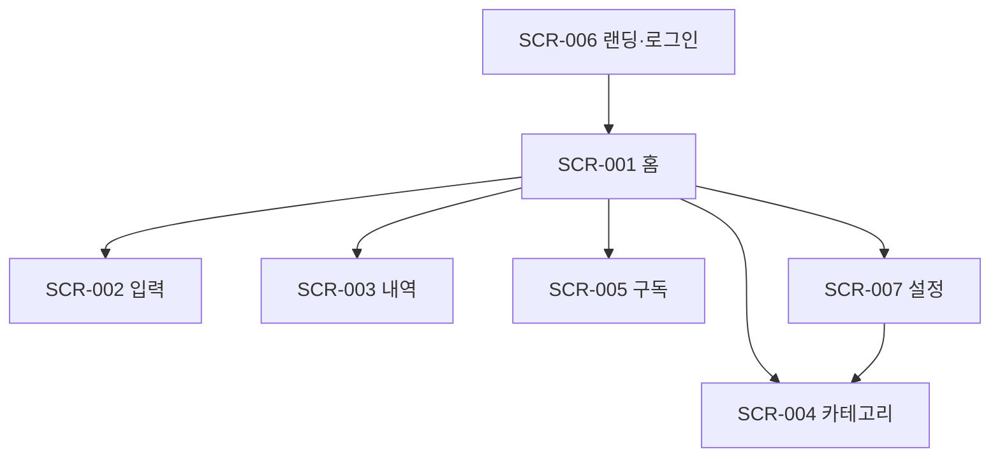

# 정보구조 · 화면 목록 (MVP §7 승계 + 확정)

## 화면 목록
| SCR-ID | page_code | 화면 | 라우트 | 인증 | 렌더링 | 문서 |
| ---- | ---- | ---- | ---- | ---- | ---- | ---- |
| SCR-001 | HOME | 홈 대시보드 | `/` | 필요 | SSR 동적 + CSR(GSAP 카운트업·카드 등장) | SCR-001_홈대시보드.md |
| SCR-002 | INPUT | 빠른 입력 | `/input` | 필요 | SSR 셸 + CSR 폼 + Server Action | SCR-002_빠른입력.md |
| SCR-003 | TXN | 지출 내역 | `/transactions?month=YYYY-MM` | 필요 | SSR 동적(searchParams) + CSR 편집 시트 | SCR-003_지출내역.md |
| SCR-004 | CAT | 카테고리·감시 대상 | `/categories` | 필요 | SSR + CSR 토글 | SCR-004_카테고리감시대상.md |
| SCR-005 | SUB | 구독 관리 | `/subscriptions` | 필요 | SSR + CSR 폼 | SCR-005_구독관리.md |
| SCR-006 | LOGIN | 랜딩·로그인 | `/login` | 불필요 | **SSG** + CSR 폼 | SCR-006_랜딩로그인.md |
| SCR-007 | SET | 설정·계정 | `/settings` | 필요 | SSR + CSR 삭제 시트 | SCR-007_설정계정.md |

## 정적 보조 라우트 (SCR 아님)
| 라우트 | 렌더링 | 내용 |
| ---- | ---- | ---- |
| `/terms` | SSG | 이용약관 (버전 문자열 `terms_version` 노출) |
| `/privacy` | SSG | 개인정보처리방침 (분석 도구·국외 이전 고지 포함) |
| `/auth/callback` | Route Handler | 매직링크 코드 교환 → `/` 리다이렉트, 동의 없으면 `/login?consent=1` |
| `/not-found`, `/error` | 정적 | 위생 항목 |

## 내비게이션
- 하단 탭(인증 화면 공통 레이아웃 `app/(app)/layout.tsx`): 홈(SCR-001) · 내역(SCR-003) · 구독(SCR-005) · 설정(SCR-007). 카테고리(SCR-004)는 홈 카드 CTA·설정에서 진입.
- FAB(EL-HOME-004)는 인증 레이아웃 공통, SCR-002 제외 전 화면 노출.

## 라우트 그룹
```
app/
  (public)/login, terms, privacy        ← SSG
  (app)/layout.tsx                      ← 인증 가드(미들웨어 + 서버 확인), 하단 탭, FAB
  (app)/page.tsx, input, transactions, categories, subscriptions, settings
  auth/callback/route.ts
```

## 사이트맵

