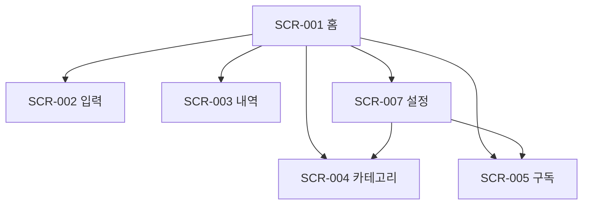

# 정보구조 · 화면 목록 (MVP §7 승계 + 확정)

## 화면 목록
| SCR-ID | page_code | 화면 | 라우트 | 인증 | 렌더링 | 문서 |
| ---- | ---- | ---- | ---- | ---- | ---- | ---- |
| SCR-001 | HOME | 홈 대시보드 | `/` | 없음 | CSR(`useDb`) + GSAP 카운트업·카드 등장 | SCR-001_홈대시보드.md |
| SCR-002 | INPUT | 빠른 입력 | `/input` | 없음 | CSR 폼 + `createTransaction` | SCR-002_빠른입력.md |
| SCR-003 | TXN | 지출 내역 | `/transactions?month=YYYY-MM` | 없음 | 서버는 month 정규화만(ƒ) + CSR 목록·편집 | SCR-003_지출내역.md |
| SCR-004 | CAT | 카테고리·감시 대상 | `/categories` | 없음 | CSR 토글·인라인 폼 | SCR-004_카테고리감시대상.md |
| SCR-005 | SUB | 구독 관리 | `/subscriptions` | 없음 | CSR 목록·추가 시트 | SCR-005_구독관리.md |
| ~~SCR-006~~ | ~~LOGIN~~ | ~~랜딩·로그인~~ | — | — | **폐기(2026-09-27)** — 1인용이라 인증 없음. DB 전환 시 복원 | SCR-006_랜딩로그인.md |
| SCR-007 | SET | 설정·데이터 | `/settings` | 없음 | CSR 백업·지우기 시트 | SCR-007_설정계정.md |

## 정적 보조 라우트 (SCR 아님)
| 라우트 | 렌더링 | 내용 |
| ---- | ---- | ---- |
| `/not-found`, `/error` | 정적 | 위생 항목 |

`/terms`·`/privacy`·`/auth/callback`은 폐기(외부 사용자·인증 없음).

## 내비게이션
- 상단 바(`components/app-header.tsx`, 화면마다 렌더): 홈(SCR-001) · 내역(SCR-003) · 구독(SCR-005) · 설정(SCR-007) + 입력 FAB. 카테고리(SCR-004)는 홈 감시 대상 카드·설정에서 진입(상단 바는 활성 탭 없이 표시).
- 입력 FAB(EL-HOME-004)는 SCR-002 제외 전 화면 노출. SCR-002는 닫기(×)만 있는 자체 상단 바.

## 라우트 구성
```
app/
  page.tsx, input, transactions (+ loading.tsx), categories, subscriptions, settings
lib/store.ts                             ← localStorage 저장소 + 계산 규칙
```

## 사이트맵

