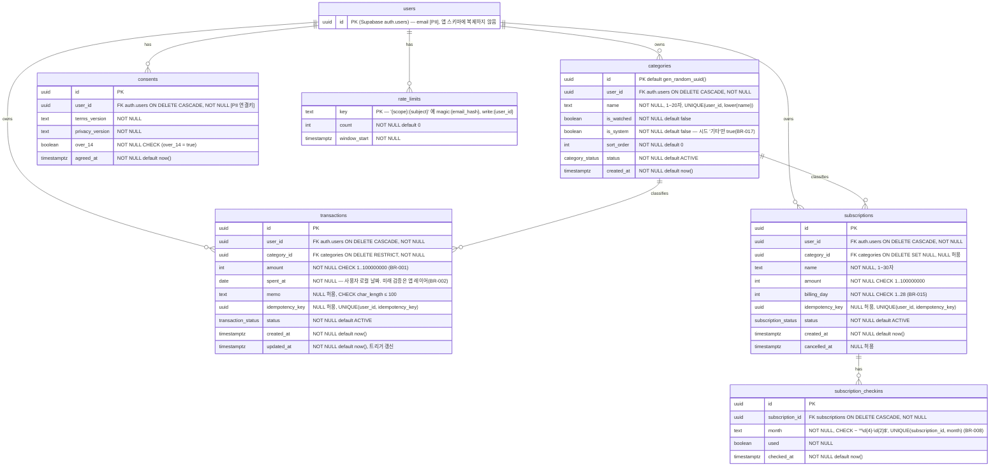

# 데이터 모델 (MVP §11 승계 후 상세화 — SSOT 이관)

## ERD


## Enum (PRD-도메인규칙_상태전이 §상태 전이와 1:1)
```sql
create type transaction_status as enum ('ACTIVE','DELETED');
create type category_status as enum ('ACTIVE','ARCHIVED');
create type subscription_status as enum ('ACTIVE','CANCELLED');
```

## 제약조건
| 테이블 | 제약 |
| ---- | ---- |
| categories | UNIQUE(user_id, lower(name)); CHECK char_length(name) BETWEEN 1 AND 20; 감시 대상 ≤5는 앱 레이어(BR-004, 트랜잭션 내 count) |
| transactions | CHECK amount; CHECK memo 길이; FK category RESTRICT; UNIQUE(user_id, idempotency_key) |
| subscriptions | CHECK billing_day; CHECK name 길이; UNIQUE(user_id, idempotency_key) |
| subscription_checkins | UNIQUE(subscription_id, month); month 형식 CHECK |
| consents | over_14 = true 강제; 최신 행 = agreed_at DESC LIMIT 1 |
| rate_limits | 앱은 service role로만 접근(RLS 정책 없음) |
| 전 사용자 테이블 | RLS enable; 정책 `user_id = auth.uid()` SELECT/INSERT/UPDATE (DELETE 정책 없음). checkins는 subscriptions 조인 정책 |

## 인덱스
| 테이블 | 인덱스 | 근거 |
| ---- | ---- | ---- |
| transactions | `(user_id, spent_at DESC) WHERE status='ACTIVE'` | 월별 내역·월 집계·최근 5건 |
| transactions | `(user_id, category_id, spent_at) WHERE status='ACTIVE'` | 카테고리별 주간·월간 횟수(BR-005), 프리셋(BR-007) |
| categories | `(user_id, status, sort_order)` | 입력 화면 칩 목록 |
| subscriptions | `(user_id, status)` | 고정비·체크인 카드 |
| subscription_checkins | UNIQUE(subscription_id, month) | 체크인 존재·해지 검토 |
| consents | `(user_id, agreed_at DESC)` | 최신 동의 조회(미들웨어) |

## 시드 (첫 로그인, BR-017)
`categories` 7행: 식비 · 배달 · 술/여가 · 구독 · 교통 · 생활 · 기타(is_system=true). 감시 대상 기본값 없음(사용자 선택 유도).

## 파기 정책 (회원 기능 시 필수)
| 대상 | 보존 기간 | 소프트 삭제→법적 파기 시점 |
| ---- | ---- | ---- |
| transactions status=DELETED | 계정 존속 중 무기한(UX용 소프트 삭제) | 계정 삭제 시 하드 삭제 |
| 계정 삭제(BR-012) | 즉시 | Server Action이 순서대로 하드 삭제: checkins → subscriptions → transactions → categories → consents → rate_limits → `auth.admin.deleteUser`. ON DELETE CASCADE가 안전망 |
| Supabase 자동 백업 내 데이터 | 플랜별 보존 기간(OQ-003, 무료 플랜은 일일 백업 7일 추정 — 확인 필요) | 보존 기간 경과 시 자동 소멸. 개인정보처리방침에 "백업본은 최대 N일 후 파기" 명시 |
| rate_limits | window 경과 후 | 크론 없이 조회 시 lazy 삭제 |
| PostHog 이벤트 | PostHog 보존 정책(기본 7년 → 프로젝트 설정으로 1년 축소) | 계정 삭제 시 PostHog person 삭제 API 호출(best-effort, 실패해도 삭제 성공 처리) |

<!-- 개인정보 필드 [PII]: auth.users.email 뿐. 그 외는 user_id로 연결되는 행위 데이터(소비 패턴) — 유출 영향 산정 시 "민감하지 않으나 식별 가능한 행위 정보"로 취급. PRD-보안및프라이버시 PII 인벤토리가 집계 -->
