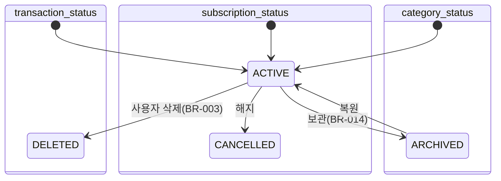

# 도메인 규칙 · 상태 전이 (MVP §9 승계, SSOT 이관)

## 비즈니스 규칙
| BR-ID | 규칙 | 강제 지점 | 에러 코드 |
| ---- | ---- | ---- | ---- |
| BR-001 | 금액은 1 이상 100,000,000 이하 정수(KRW) | zod + DB CHECK | ERR-TXN-001 |
| BR-002 | 지출일은 오늘(Asia/Seoul) 이후 불가. 과거 하한 없음 | zod(앱 레이어) | ERR-TXN-002 |
| BR-003 | 삭제는 소프트 삭제(status DELETED). 집계·피드백·프리셋에서 제외. 복원 없음 | Server Action | ERR-TXN-003 |
| BR-004 | 감시 대상은 사용자당 최대 5개 | Server Action(count 후 갱신, 트랜잭션) | ERR-CAT-001 |
| BR-005 | 피드백 문구 = CPY-INPUT-004 템플릿. 주=월요일 시작. 전월 동기간=전월 1일~min(오늘 일자, 전월 말일). 전월 0건이면 CPY-INPUT-005(비교 구절 생략) | Server Action `createTransaction` 응답 | — |
| BR-006 | 고정비 = ACTIVE 구독 amount 합. 거래 자동 생성 없음 | 대시보드 집계 | — |
| BR-007 | 프리셋 = 최근 30일 ACTIVE 거래의 (category_id, amount) 빈도 상위 4, 2회 이상만. 보관 카테고리 제외 | 서버 조회 | — |
| BR-008 | 체크인은 (subscription_id, month) 당 1회. 월 첫 진입 시 미신고 ACTIVE 구독이 있으면 SCR-001에 카드 노출 | DB UNIQUE | ERR-SUB-001 |
| BR-009 | 카테고리 이름 사용자 내 유일(대소문자·공백 trim 후), 1~20자 | zod + DB UNIQUE | ERR-CAT-002 / ERR-CAT-003 |
| BR-010 | 직전 2개월 체크인이 모두 used=false면 "해지 검토" 배지. 미응답은 N으로 세지 않음 | 서버 조회 | — |
| BR-011 | 첫 로그인 시 약관·개인정보·만 14세 이상 동의 없이는 인증 화면 진입 불가. 동의 버전·시각 저장. 약관 버전 상승 시 재동의 | 미들웨어 + Server Action | ERR-AUTH-003 |
| BR-012 | 계정 삭제 시 사용자 전 데이터 하드 삭제 후 auth 사용자 삭제(service role, 서버 전용). 백업 내 데이터는 보존 기간 경과 후 소멸 | Server Action `deleteAccount` | ERR-ACC-001 / ERR-ACC-002 |
| BR-013 | 매직링크 발송 이메일당 3회/5분 | Server Action + rate_limits | ERR-AUTH-002 |
| BR-014 | 보관(ARCHIVED) 카테고리는 입력 화면·프리셋에서 숨기되 기존 거래·집계는 유지. 보관 시 is_watched는 false로 강제 | Server Action | — |
| BR-015 | 구독 결제일은 1~28 (월말 편차 회피) | zod + DB CHECK | ERR-SUB-002 |
| BR-016 | 메모 최대 100자, trim, 빈 문자열은 NULL | zod | ERR-TXN-004 |
| BR-017 | 시드 카테고리 7개(식비·배달·술/여가·구독·교통·생활·기타)는 첫 로그인 시 생성. "기타"는 보관 불가 | Server Action | ERR-CAT-005 |

## 상태 전이

DB enum: `transaction_status(ACTIVE, DELETED)` / `category_status(ACTIVE, ARCHIVED)` / `subscription_status(ACTIVE, CANCELLED)` — PRD-데이터모델과 1:1.

## 계산 규칙 (`lib/domain/*.ts`, 단위 테스트 필수)
| 항목 | 함수 | 공식 | 경계 |
| ---- | ---- | ---- | ---- |
| 이번 주 횟수 | `countThisWeek` | count(ACTIVE, category, spent_at ∈ [이번 주 월요일, 오늘]) | 월요일 첫 입력 = 1번째 |
| 이번 달 누적 | `sumThisMonth` | sum(amount, ACTIVE, category, 이번 달) | — |
| 전월 동기간 비교 | `diffVsPrevMonthToDate` | count(이번 달 1일~오늘) − count(전월 1일~전월 min(d, 말일)) | 전월 0건 → null(구절 생략) |
| 피드백 문구 | `buildFeedback` | BR-005 조합 | 감시 대상 여부 플래그 동반 |
| 월 총 지출 | `monthTotal` | sum(ACTIVE 거래, 이번 달) + fixedCost | 구독 0개 → 0 |
| 고정비 | `fixedCost` | sum(ACTIVE 구독 amount) | — |
| 프리셋 | `derivePresets` | BR-007 | 동률은 최근 사용순 |
| 해지 검토 | `needsCancelReview` | 직전 2개월 체크인 모두 used=false | 미응답 제외 |
| 날짜 경계 | `seoulToday`, `weekStart`, `monthRange` | Asia/Seoul 기준 | DST 없음 |
