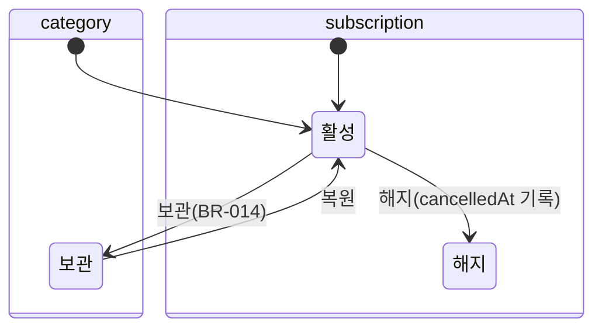

# 도메인 규칙 · 상태 전이 (MVP §9 승계, SSOT 이관)

## 비즈니스 규칙
| BR-ID | 규칙 | 강제 지점 | 에러 코드 |
| ---- | ---- | ---- | ---- |
| BR-001 | 금액은 1 이상 100,000,000 이하 정수(KRW) | 입력·편집 폼 | ERR-TXN-001 |
| BR-002 | 지출일은 오늘(Asia/Seoul) 이후 불가. 과거 하한 없음 | 입력·편집 폼 (`max=today`) | ERR-TXN-002 |
| BR-003 | 삭제는 **하드 삭제**(배열에서 제거). 복원 없음 — 필요하면 백업 파일로 | `deleteTransaction` | — |
| BR-004 | 감시 대상은 최대 5개 | 카테고리 화면(초과 탭 시 토스트) | ERR-CAT-001 |
| BR-005 | 피드백 문구 = CPY-INPUT-004 템플릿. 주=월요일 시작. 전월 동기간=전월 1일~min(오늘 일자, 전월 말일). 전월 0건이면 CPY-INPUT-005(비교 구절 생략) | 입력 화면 저장 직후 `getDb()`로 계산 | — |
| BR-006 | 고정비 = 해지 안 된 구독 amount 합. 거래 자동 생성 없음 | `fixedCost` | — |
| BR-007 | 프리셋 = 최근 30일 거래의 (카테고리, 금액) 빈도 상위 4, 2회 이상만. 보관 카테고리 제외. 동률은 최근 입력순 | `derivePresets` | — |
| BR-008 | 체크인은 (구독, 월)당 1개 — 다시 답하면 덮어씀. 이번 달 미응답 해지 안 된 구독이 있으면 SCR-001에 카드 노출 | `submitCheckin` | — |
| BR-009 | 카테고리 이름 유일(대소문자 무시·trim 후, 보관 포함), 1~20자 | 카테고리 화면 | ERR-CAT-002 / ERR-CAT-003 |
| BR-010 | 이번 달·직전 달 체크인이 모두 used=false면 "해지 검토" 배지. 미응답은 미사용으로 세지 않음 | `needsReview` | — |
| ~~BR-011~~ | **폐기** — 약관·개인정보 동의 게이트(인증 없음). DB·외부 공개 전환 시 복원 | — | — |
| BR-012 | "모든 데이터 지우기"는 확인어 `삭제`를 정확히 입력해야 실행. 실행 즉시 저장 키 삭제 → 시드로 재시작. 되돌릴 수 없음(백업 파일만 예외) | 설정 화면 + `clearAll` | ERR-CLEAR-001 |
| ~~BR-013~~ | **폐기** — 매직링크 발송 제한(인증 없음) | — | — |
| BR-014 | 보관 카테고리는 입력 화면·프리셋에서 숨기되 기존 거래·집계는 유지. 보관 시 감시 대상 해제 강제 | `updateCategory` | — |
| BR-015 | 구독 결제일은 1~28 (월말 편차 회피) | 구독 추가 시트 | ERR-SUB-002 |
| BR-016 | 메모 최대 100자, trim | 폼 + `createTransaction`(trim) | ERR-TXN-004 |
| BR-017 | 시드 카테고리 7개(식비·배달·술/여가·구독·교통·생활·기타)는 **첫 실행** 시 생성. "기타"는 보관 불가 | `seed()` + 카테고리 화면 | ERR-CAT-005 |
| BR-018 | 백업 가져오기는 형식(`version: 1` + 배열 4개)이 맞을 때만, 확인 후 현재 데이터를 통째로 교체 | 설정 화면 + `importJson` | ERR-BACKUP-001 |

## 상태 전이

거래는 상태가 없다(삭제 = 제거, BR-003). 저장 필드: `Category.archived` / `Subscription.cancelledAt` — PRD-데이터모델과 1:1.

## 계산 규칙 (`src/lib/store.ts`, 검사 `npm run check`)
| 항목 | 함수 | 공식 | 경계 |
| ---- | ---- | ---- | ---- |
| 이번 주 횟수 | `countThisWeek` | count(category, date ∈ [이번 주 월요일, 오늘]) | 월요일 첫 입력 = 1번째 |
| 이번 달 누적 | `sumThisMonth` | sum(amount, category, 이번 달) | — |
| 전월 동기간 비교 | `diffVsPrevMonthToDate` | count(이번 달 1일~오늘) − count(전월 1일~전월 min(d, 말일)) | 전월 0건 → null(구절 생략) |
| 월 총 지출 | `selectHome` 안 | sum(이번 달 거래) + fixedCost | 구독 0개 → 거래 합 |
| 고정비 | `fixedCost` | sum(해지 안 된 구독 amount) | — |
| 프리셋 | `derivePresets` | BR-007 | 동률은 최근 입력순 |
| 해지 검토 | `needsReview` | BR-010 | 미응답 제외 |
| 날짜 경계 | `todayStr`, `addMonth` | Asia/Seoul 기준 | DST 없음 |
